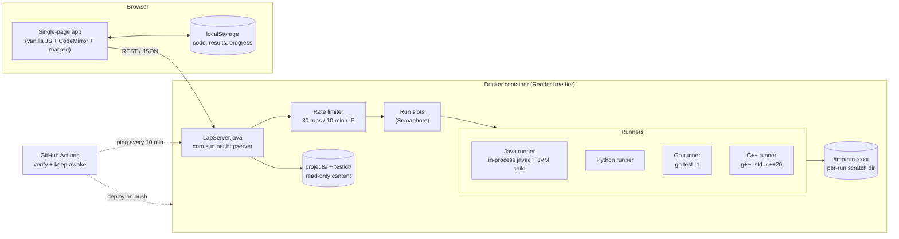
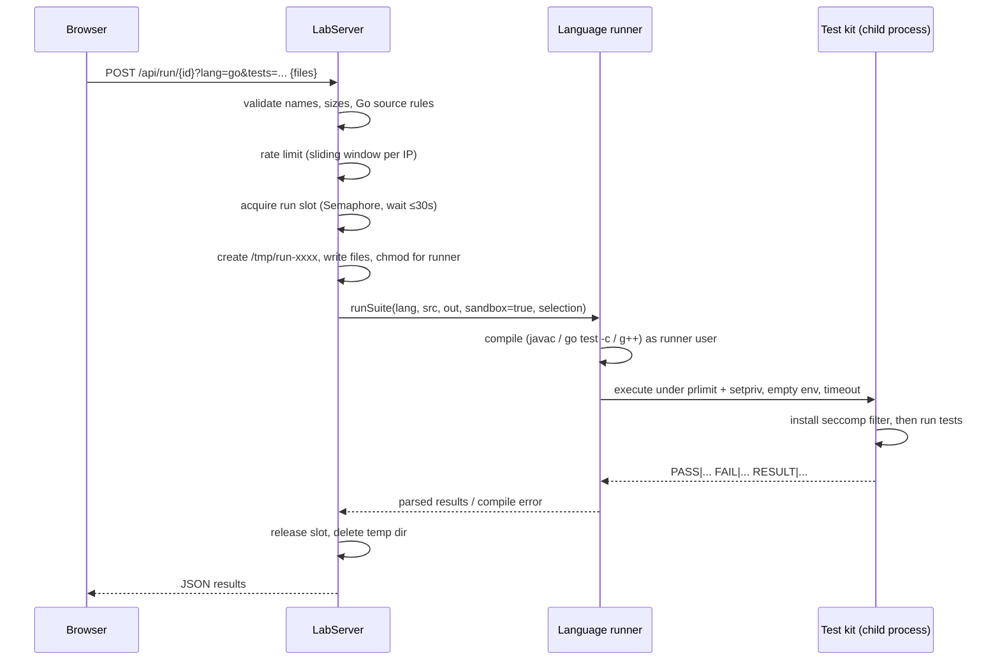
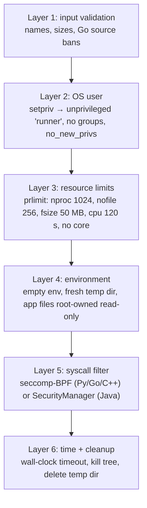
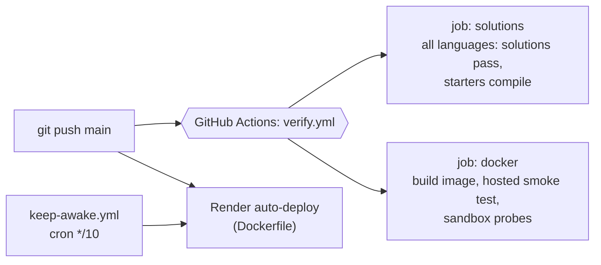

# Build Lab: Architecture (HLD + LLD)

Build Lab is a self-hosted practice platform for backend engineering. Users pick a project
(18 so far: "build" projects and "debug" projects with planted bugs), read a spec, write code in the browser,
and run a hidden-but-readable test suite against it in **Java, Python, Go or C++**.

- Live: https://build-lab.onrender.com
- Repo: https://github.com/AdityaMalu/build-lab (MIT)

---

## 1. Requirements

### Functional
| # | Requirement |
|---|---|
| F1 | Browse a catalog of projects with type (build/debug), difficulty and focus areas |
| F2 | Read a spec (Markdown) per project and per language |
| F3 | Edit code in the browser with syntax highlighting; starter code is provided |
| F4 | Run **all**, **selected**, or **only previously failed** tests and see per-test pass/fail, message and timing |
| F5 | Compare against a reference solution; reset to starter |
| F6 | Track progress (todo / attempted / solved) **separately per language** |
| F7 | Work two ways: **local mode** (files on disk, edit in any IDE) and **hosted mode** (public website, many users) |
| F8 | Back up / restore browser-stored work (hosted mode) |

### Non-functional
| Concern | Target / decision |
|---|---|
| Security | Untrusted code from anonymous users must not read secrets, write outside its folder, open network sockets, spawn processes or touch other users' runs |
| Cost | $0: runs on a free 512 MB container (Render free tier), CI on GitHub Actions |
| Simplicity | Zero external dependencies on the server: **pure JDK**, single file, no build tool |
| Statelessness | Hosted server stores nothing per user → restarts and redeploys lose nothing |
| Fairness | Per-client rate limit + bounded concurrent runs so one user can't starve others |
| Portability | Same server runs on Windows, macOS, Linux, Codespaces and Docker |
| Correctness of content | Every reference solution must pass and every starter must compile in all languages, enforced in CI |

---

## 2. High-Level Design



### Components
| Component | Responsibility |
|---|---|
| **Web UI** (`web/`) | Catalog, spec view, multi-file editor, test list with checkboxes, results panel, language picker, export/import backup |
| **LabServer** (`server/LabServer.java`) | Static files, REST API, test discovery, compile + run orchestration, output parsing, sandbox wrapping, rate limiting |
| **Content** (`projects/`) | Per project: spec, and per language `starter/`, `tests/`, `solution/` |
| **Test kits** (`testkit/<lang>`) | A tiny test framework per language that prints a common line protocol, plus the seccomp sandbox |
| **CI** (`.github/workflows`) | `verify.yml`: all solutions pass, all starters compile, Docker image smoke test, sandbox escape probes. `keep-awake.yml`: prevents free-tier sleep |
| **Hosting** | `Dockerfile` + `render.yaml` blueprint, auto-deploy on push to `main` |

### Two deployment modes
| | Local mode | Hosted mode (`LAB_MODE=hosted`) |
|---|---|---|
| Users | one (you) | anyone with the URL |
| Code storage | `workspace/<id>/<lang>/src` on disk | browser `localStorage`, sent with each run |
| Progress | `workspace/progress.json` | browser `localStorage` |
| Write APIs (`PUT /file`, `/reset`, `/status`) | enabled | disabled (404) |
| Execution | normal child processes | sandboxed (section 5) |

**Why stateless hosting?** No database, no auth, no PII, no backups to manage. The free instance can restart at
any moment without data loss. The trade-off (work lives in one browser) is mitigated by Export/Import backup.

### Process roles (hosted mode)
| `LAB_ROLE` | What runs | Used on |
|---|---|---|
| `all` (default) | one process serves the site and runs tests itself (`RUN_SLOTS` semaphore) | local, Codespaces, Render |
| `api` + `worker` | API queues runs on a Redis stream and waits for the result; workers consume it with a consumer group and run each job in a fresh gVisor container | Oracle VM ([deploy/oracle](../deploy/oracle/README.md)) |

The browser can't tell the two apart: same endpoints, same responses.

---

## 3. API

| Method | Path | Purpose |
|---|---|---|
| GET | `/api/config` | `{mode, langs}`: which languages have toolchains installed (also the health check) |
| GET | `/api/projects` | catalog + progress + languages available per project |
| GET | `/api/project/{id}?lang=` | spec, file lists (workspace/tests/solution) |
| GET | `/api/tests/{id}?lang=` | discovered tests: suite, method, display name |
| GET | `/api/file?project=&lang=&area=&path=` | read a file from starter / tests / solution / workspace |
| POST | `/api/run/{id}?lang=&mode=&tests=Suite#method,...` | compile + run; hosted mode body is `{path: source}` (1..30 files, ≤100 KB each, ≤1 MB total) |
| PUT | `/api/file?...` | save a workspace file (local only) |
| POST | `/api/reset/{id}?lang=` | restore starter (local only) |
| POST | `/api/status/{id}?lang=` | set todo/attempted/solved (local only) |
| GET | `/metrics` | Prometheus metrics: runs by language/outcome, time per phase, run slots, heap (token-protected when `LAB_METRICS_TOKEN` is set) |

Run response:
```json
{ "passed": 7, "failed": 2, "total": 9, "compileError": null, "ms": 1240,
  "results": [ {"suite":"TokenBucketTest","method":"refill","name":"refills fractionally","ok":true,"ms":3}, ... ] }
```

Errors map to status codes: bad input → 400, unknown/missing language → 404, body too large → 413,
rate limit → 429, all run slots busy for 30 s → 503.

---

## 4. Low-Level Design

### 4.1 Content layout (convention over configuration)
```
projects/catalog.json
projects/<id>/README.md                 spec (Java, also fallback)
projects/<id>/<lang>/README.md          language-specific spec
projects/<id>/<lang>/starter/src        copied to the user's workspace on first open
projects/<id>/<lang>/tests/src
projects/<id>/<lang>/solution/src
```
A language is "available" for a project iff `<lang>/starter/src` exists, so adding a port needs **no code change**.

### 4.2 Common test protocol (the key abstraction)
Each language's test kit prints the same line protocol on stdout, so **one parser** serves all languages:
```
PASS|Suite|method|display name|ms
FAIL|Suite|method|display name|ms|message
RESULT|passed|failed|total
```
Go is the exception: it uses the standard `testing` package, and `parseGoOutput` converts `go test -v`
output (`--- PASS: TestX (0.01s)`) into the same model.

### 4.3 Test discovery and selection
The server scans test sources with regexes (no compilation needed) to list tests for the UI:

| Language | Test declaration |
|---|---|
| Java | `@Test("name") void method()` |
| Python | `@test("name")` methods in classes ending `Test`, files `*_test.py` |
| Go | `// Test: name` comment above `func TestX(t *testing.T)` |
| C++ | `LAB_TEST(Suite, method, "name")` macro (static self-registration) |

Selection `?tests=Suite#method,...` is validated against the discovered set, then passed to the runner
(Java/Python/C++ filter in the harness; Go uses `-test.run '^(TestA|TestB)$'`).

### 4.4 Run pipeline


### 4.5 Per-language runners
| | Compile | Execute | Notes |
|---|---|---|---|
| **Java** | in-process `javax.tools` compiler, three roots: kit → tests → user code | child JVM with `-Xmx`, SecurityManager policy granting user code nothing | no external `javac` needed |
| **Python** | no separate compile; import/syntax errors come back as `COMPILE\|...` lines | `lab_runner.py` imports test modules, runs `@test` methods | sandbox via `ctypes` + `prctl` |
| **Go** | throwaway module, `go test -c` → test binary, `CGO_ENABLED=0`, shared pre-warmed `GOCACHE` | binary with `-test.v` | a generated `zz_labsandbox_test.go` imports the sandbox package so it initialises before user code |
| **C++** | `g++ -std=c++20 -O1` with header-only `labtest.hpp` + `labtest_main.cpp` (+`-static` on Windows) | the produced binary | sandbox via `__attribute__((constructor(101)))`, runs before any user static initialiser |

Each run has a wall-clock timeout (90 s sandboxed, 180 s locally); a process that exits without `RESULT` is reported as
"test process ended before reporting results" (crash, `exit()`, or killed by the sandbox).

### 4.6 Concurrency and fairness
- **Rate limiter:** sliding-window log. `Map<clientIp, ArrayDeque<timestamp>>` guarded by one lock;
  evict entries older than 10 minutes, reject at 30 → HTTP 429. Client IP comes from `X-Forwarded-For`
  (set by Render's proxy). Map is cleared past 10k keys as a crude memory bound.
- **Bulkhead:** `Semaphore RUN_SLOTS` sized by `LAB_PARALLEL_RUNS` (1 on the 512 MB free instance);
  callers wait up to 30 s, then get 503 instead of piling up threads.
- **Memory budget:** server JVM `-Xmx150m`, test JVM heap `LAB_TEST_HEAP=200m`, serial GC.

### 4.7 Front-end design
- No framework, no build step: one `app.js` with hash routing (`#/`, `#/project/<id>`).
- Libraries from CDN: CodeMirror (Java/Python/Go/C++ modes) and marked; it degrades to `<pre>` if the CDN fails.
- Storage keys are namespaced per language: `buildlab.code.<lang>.<id>:<file>`, `buildlab.results.<lang>.<id>`,
  progress key `lang:id`. Older keys migrate automatically.
- **Staleness detection:** each stored result keeps a hash of the code it ran against; edited files mark
  results "stale" so "run failed" means "failed *on the current code*".
- Unsaved-change guard on navigation and language switch.

### 4.8 Validation rules (defence in depth at the edge)
- Project ids `[a-z0-9-]{1,64}`, language from a fixed allowlist.
- Upload filenames per language regex (e.g. Go must be `pkg/file.go`, never `_test.go`, so tests can't be replaced).
- Path normalisation + `startsWith(root)` check on every file access (no `../` traversal).
- Go source bans `import "C"`, `unsafe`, `os/exec`, `plugin`, `//go:linkname`, `//go:cgo*`, `//go:embed`.

### 4.9 Observability
Every run writes one JSON log line (language, project, outcome, queue/compile/exec/total ms) to stdout and,
optionally, Grafana Loki, and updates Prometheus counters and histograms on `/metrics`. Details: [OBSERVABILITY.md](OBSERVABILITY.md).

---

## 5. Sandbox design (hosted mode)

Layered so that one failing layer is not enough to escape.



**Seccomp filter (x86-64, installed by the harness before user code, with TSYNC for all threads):**
denies `execve/execveat`, `fork/vfork`, `clone` without `CLONE_THREAD` (threads allowed, processes not),
`clone3` (returns ENOSYS so runtimes fall back to `clone`), non-`AF_UNIX` sockets, `ptrace`,
`process_vm_*`, `kill/tkill`, `mount/unshare/setns`, `io_uring`, `bpf`, `perf_event_open`, keyrings,
kernel modules and the `setuid` family; kills the x32 ABI to prevent syscall-number aliasing.

**Verified continuously:** CI builds the real Docker image and submits probe programs in every language
that try to read `/etc/shadow`, write into `/app`, open an internet socket, start a process and signal PID 1.
The build fails if any probe succeeds.

---

## 6. Deployment and CI/CD



- Image: `eclipse-temurin:21-jdk` + `python3` + `g++` + Go 1.23; Go std library pre-compiled into
  `/opt/gocache` at build time to cut first-run latency.
- Health check: `GET /api/config`.
- Alternatives supported: GitHub Codespaces (`.devcontainer/` installs all toolchains and auto-starts the
  lab on port 8090) and plain local run with `java server/LabServer.java`.

---

## 7. Key design decisions and trade-offs

| Decision | Why | Trade-off |
|---|---|---|
| Single-file pure-JDK server | runs anywhere Java runs, no Maven/Gradle, easy to audit | hand-rolled JSON and routing |
| Filesystem as the content database | projects are reviewed in PRs like code; adding a port = adding folders | no dynamic content editing |
| Stateless hosted mode, state in the browser | no DB, no auth, no privacy risk, free hosting survives restarts | work is per-browser (mitigated by export/import) |
| Common text protocol between harness and server | one parser, easy to add a language | each kit must follow it (Go adapted via a parser) |
| Compile per run, no warm workers | strong isolation, nothing shared between users | Go ≈25 s, C++ ≈35 s per run on the free CPU |
| `LAB_PARALLEL_RUNS=1` + queue with 30 s timeout | fits in 512 MB without OOM | throughput is one run at a time on the free tier |
| Layered sandbox instead of containers-per-run | Render free tier can't run nested Docker / gVisor | relies on kernel seccomp + user separation, so it's proven by CI probes |
| Tests are readable but not editable | tests are part of the spec | users see expected behaviour (intended for practice) |

## 8. How it would scale (next steps)
- **Separate the run fleet:** API server enqueues jobs (SQS/Redis), stateless workers in Firecracker/gVisor
  microVMs pull them; autoscale on queue depth.
- **Warm pools:** pre-started per-language workers with cached toolchains to drop Go/C++ latency below 5 s.
- **Accounts + sync:** optional login with progress in a small key-value store (DynamoDB), keeping the
  anonymous mode.
- **Distributed rate limiting:** move the per-IP window to Redis (token bucket via Lua) once there is more
  than one server instance.
- **Observability:** structured logs per run (language, project, duration, outcome), p95 latency and
  queue-wait dashboards.

## 9. Numbers
- 18 projects × up to 4 languages; ~1.4k-line server, ~0.9k-line UI.
- Every push: all reference solutions pass and all starters compile in all languages, plus sandbox probes.
- Live latency (free tier): Python ≈1 s, Go ≈25 s, C++ ≈35 s per run (Go and C++ are dominated by compile time on the shared CPU).
