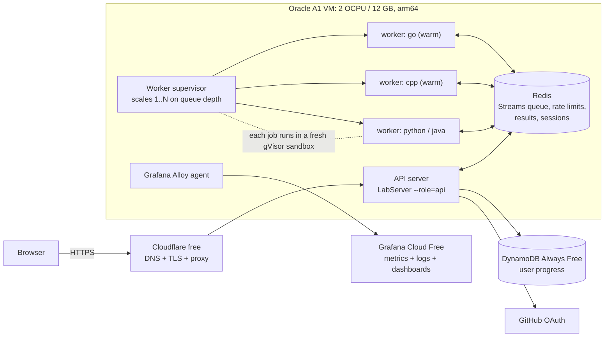

# MachineCodingLab: Scaling Plan (free tier only)

Goal: implement the five "next steps" from [ARCHITECTURE.md](ARCHITECTURE.md) without paying, and be clear
about where a free tier stops.

## 0. Can each item be done for free?

| Item | Free? | Free option | Limit / catch |
|---|---|---|---|
| Separate run fleet + queue | **Yes** | Oracle Cloud Always Free Arm VM (Ampere A1) + Redis Streams on the same VM | one VM, so no real machine autoscaling (we scale worker *processes*) |
| microVM isolation | **gVisor: yes. Firecracker: no** | gVisor `runsc --platform=systrap` needs no KVM, so it runs on a normal VM | Firecracker needs KVM (bare metal or nested virtualisation), which no free tier offers |
| Warm pools, Go/C++ < 5 s | **Likely** | the A1 VM's 2 dedicated cores instead of Render's tiny CPU share, plus compile caches | the < 5 s target must be measured, not assumed |
| Accounts + sync | **Yes** | GitHub OAuth (free) + DynamoDB Always Free (25 GB, 25 RCU/WCU) | AWS signup needs a card; set a $1 budget alert |
| Distributed rate limiting | **Yes** | self-hosted Redis on the VM (unlimited), or Upstash free (256 MB, 500K commands/month) | only needed once there are 2+ API instances |
| Observability | **Yes** | Grafana Cloud Free: 10k metric series, 50 GB logs/month, 14-day retention | keep metric labels low-cardinality |

**Oracle Always Free today:** Ampere A1 with **2 OCPU / 12 GB RAM** (Oracle halved it from 4 / 24 in mid-2026,
with no announcement), 200 GB block storage, plus 2 tiny AMD micro VMs.
Risks:
- Oracle may reclaim Always Free instances that sit idle (low CPU over a week); the keep-awake ping helps.
- A1 capacity is sometimes "out of host capacity" in popular regions.
- Oracle can change limits again without notice.

**Mitigation:** keep the current Render deployment working as a fallback (single-process mode), the same way
local mode still exists today.

### Target architecture (all free)



---

## Phase 1: Observability first (≈1–2 days, works on today's Render setup): **built**, see [OBSERVABILITY.md](OBSERVABILITY.md)

Measure before optimising, so the "< 5 s" goal has a baseline.

1. **One structured log line per run** (JSON on stdout):
   `{"ts","run_id","lang","project","mode","selected","outcome":"pass|fail|compile_error|timeout|rejected","queue_ms","compile_ms","exec_ms","total_ms","tests_passed","tests_total"}`.
   Never log source code or IPs (hash the IP if needed for abuse checks).
2. **Split timing inside `runSuite`** into `queue_ms` (waiting for the slot), `compile_ms` and `exec_ms`.
3. **`/metrics` endpoint** in Prometheus text format, hand-written to keep the server dependency-free:
   - `lab_runs_total{lang,outcome}` counter
   - `lab_run_seconds_bucket{lang,phase}` histogram, with `phase` = queue | compile | exec
   - `lab_queue_depth` gauge, `lab_rate_limited_total` counter

   Cardinality is about 4 langs × 5 outcomes, plus 4 × 3 phases × 12 buckets ≈ 170 series, far below the 10k
   free limit. **Don't add `project` as a metric label**; keep it in logs only.
4. **Grafana Cloud Free:** Alloy agent (or Render's log stream) pushes logs to Loki, and metrics are scraped
   into Prometheus.
   - Dashboards: p50/p95/p99 run time per language and phase, queue wait p95, runs per hour, error-rate pie,
     429 count.
   - Alerts: p95 > 60 s for 15 min, or compile_error + timeout rate > 50 %.

**Done when:** the dashboard shows the baseline p95 for Go and C++ on Render (expect about 25 s and 35 s).

**Baseline measured on 2026-10-05** (Render free tier, Rate Limiter reference solution, three runs each):
Go compile 24.4 s / 6.4 s / 5.4 s (its build cache helps once a package has been compiled), C++ compile
31.4 s / 33.4 s / 31.4 s (no cache). Running the tests takes under 0.5 s in both, so **compilation is the
whole cost**. For comparison, a 4-core arm64 CI runner compiled the same Go in 0.75 s and C++ in 3.1 s.

## Phase 2: Split API and workers, with a queue and gVisor (≈4–6 days): **built**, see [deploy/oracle](../deploy/oracle/README.md)

*As built, two simplifications versus the plan below:*
- *The API holds the request open with `BLPOP` on the result, so the browser API didn't change; there's no
  202 and polling.*
- *Jobs whose worker died are dropped by a sweeper rather than retried, because by then the browser has
  stopped waiting.*

*The worker runs on the VM host under systemd, so no container gets the Docker socket. Also new: the seccomp
filter now has an arm64 table, and Go/C++ fail closed on unknown architectures. Before this, they silently
ran without the filter on arm64.*

1. **Provision the VM:** Oracle A1 Ubuntu 24.04 arm64.
   - Install Docker, `runsc` (gVisor), Redis 7 (bound to localhost, password set) and the toolchains.
   - Open only ports 80/443 and put Cloudflare free in front for TLS.
2. **One codebase, two roles:** `java server/LabServer.java --role=api|worker|all`. Default `all` is today's
   behaviour, so local mode and Render keep working.
3. **Queue: Redis Streams** (not SQS: same box, ~1 ms latency, no request quota).
   - API: validate (same rules as today), rate limit, then `XADD jobs:<lang> MAXLEN ~ 1000 * job=<json>`.
     Return `{"runId"}` with **202**.
   - Worker: `XREADGROUP GROUP workers <name> BLOCK 5000 STREAMS jobs:<lang> >`, run the job, write
     `SET result:<runId> <json> EX 600`, `XACK`.
   - Crash recovery: `XAUTOCLAIM` jobs pending > 120 s, retry once, then mark `outcome=worker_lost`.
   - Browser: polls `GET /api/run-result/<runId>` (or the API holds the request open up to 60 s with long
     polling). The UI shows "queued (position N)" from `XLEN`.
4. **Isolation: each job runs in a fresh gVisor container:**
   ```
   docker run --rm --runtime=runsc --network=none --read-only --tmpfs /work:size=64m \
     --memory=512m --cpus=1 --pids-limit=256 --user runner lab-runner-<lang> ...
   ```
   - gVisor becomes the main boundary. The existing layers stay as defence in depth: prlimit/setpriv,
     Go source bans, and the in-harness seccomp filter.
   - **Port the seccomp filter to arm64:** today's filter is x86-64 only. arm64 has different syscall
     numbers and no `fork`/`vfork` syscalls.
   - Run the CI sandbox probes on a GitHub arm64 runner as well.
5. **Autoscaling (within the VM):** a small supervisor loop every 5 s:
   - `desired = clamp(ceil(backlog / 2), min=1, max=memory_budget / 600MB)` per language.
   - Scale workers down after 5 min idle.
   - The memory budget comes from the 12 GB total, minus about 1.5 GB for the OS, API and Redis.

   True multi-machine autoscaling would need paid compute, but the same queue-depth signal would then drive a
   cloud autoscaling group.

**Done when:**
- All CI probes pass inside gVisor on arm64.
- 20 concurrent runs queue and complete with no OOM.
- Killing a worker mid-run gets the job retried.

## Phase 3: Warm pools and compile caching, target p95 < 5 s for Go/C++ (≈3–5 days)

**Step 1, compile caching, built.** It helps every deployment, Render included. Measured locally, warm:

| | Before | After | How |
|---|---|---|---|
| C++ | 15.7 s | ~3 s (6 s with `<regex>`) | `-O0`; kit objects and a precompiled header built once (`/opt/cppkit`) |
| Go | 13 s (39 s cold) | ~1.7 s | `LabServer warmup` fills `/opt/gocache` at image build; `-trimpath` so the cache survives per-run folders; `-vet=off` |

Warm workers and the result cache (steps 2 and 6 below) are still to do.

Ordered by expected gain; measure each step on the Phase 1 dashboard.

1. **More CPU:** 2 dedicated A1 cores vs Render's small shared slice. This alone should be the biggest drop.
2. **Warm workers:** one pre-started gVisor sandbox per language sits idle with its toolchain loaded and takes
   the next job. After a job it is **discarded** and a new one is pre-started in the background, so nothing
   leaks between users and container start time stays off the critical path.
3. **Go:**
   - persistent read-only `GOCACHE`, pre-warmed with the std library *and* every project's tests compiled
     against its solution, so only the user's package recompiles
   - `-p 2`, `GOFLAGS=-trimpath`
4. **C++:**
   - precompile `labtest.hpp` plus common std headers into a **PCH**
   - compile `labtest_main.cpp` and `labsandbox.cpp` to `.o` once at image build
   - user code at `-O0` (tests are correctness, not speed)
   - link with `-fuse-ld=mold` (or `lld`)
5. **Java:** keep a warm JVM per worker with in-process `javac`. For each job, fork a fresh test JVM using
   AppCDS (class data sharing) to start faster.
6. **Result cache:** key `sha256(lang, project, selection, files)` → result, 10 min TTL. A re-run with no
   change returns instantly.

**Done when:** p95 total for Go and C++ is under 5 s at normal load. If it isn't, report the measured
numbers and which step stopped helping.

## Phase 4: Optional accounts with sync (≈3–4 days)

1. **Login:** "Sign in with GitHub" using a free OAuth App, authorization-code flow with PKCE and `state`.
   - Session: a random 256-bit id in an `HttpOnly; Secure; SameSite=Lax` cookie, stored in Redis
     (`session:<id>` → userId, 30-day TTL).
   - No passwords stored anywhere.
2. **Anonymous mode stays the default.** On first sign-in, offer to upload the browser's localStorage
   progress (the same JSON as today's Export backup).
3. **DynamoDB, single table:** `PK = USER#<githubId>`, with these sort keys:
   - `SK = PROGRESS#<lang>#<project>`: `{status, updatedAt}`
   - `SK = CODE#<lang>#<project>#<file>`: source, ≤100 KB, the same limit as uploads
   - Merge rule on sync: last-write-wins per file by `updatedAt`.
   - Size check: 25 GB covers thousands of users. Keep reads/writes per request small to stay under
     25 RCU/WCU, and debounce code saves to every 5 s.
4. **Privacy:**
   - Store only the GitHub id and login name.
   - Add a "Delete my account" endpoint that removes all items for the user.
   - Add a short privacy note on the site.

**Done when:** progress made on one browser shows up after signing in on another; signed-out use is unchanged.

## Phase 5: Distributed rate limiting (≈1 day; switch on with the second API instance)

1. **Token bucket in one Lua script** (atomic, no races between instances):
   ```lua
   -- KEYS[1]=bucket key, ARGV: capacity, refill_per_ms, now_ms, cost
   local b = redis.call('HMGET', KEYS[1], 'tokens', 'ts')
   local cap, rate, now, cost = tonumber(ARGV[1]), tonumber(ARGV[2]), tonumber(ARGV[3]), tonumber(ARGV[4])
   local tokens = tonumber(b[1]) or cap
   local ts = tonumber(b[2]) or now
   tokens = math.min(cap, tokens + (now - ts) * rate)
   local ok = tokens >= cost
   if ok then tokens = tokens - cost end
   redis.call('HSET', KEYS[1], 'tokens', tokens, 'ts', now)
   redis.call('PEXPIRE', KEYS[1], math.ceil(cap / rate))
   return { ok and 1 or 0, tostring(tokens) }
   ```
   Use Redis `TIME` (or pass one clock) so instances with skewed clocks agree.
2. **Keys and costs:**
   - `rl:ip:<ip>`: capacity 30, refill 30 per 10 min, the same policy as today
   - `rl:user:<id>`: a more generous bucket for signed-in users
   - Cost: 1 per run, 2 for Go/C++ (they use the most CPU)
3. **Response headers:** `X-RateLimit-Limit`, `X-RateLimit-Remaining`, `Retry-After` on 429.
4. **Fail policy:** if Redis is down, **fail closed** for runs (they're the expensive part) and **fail open**
   for reads.

This reuses the project's own Rate Limiter problem as the design reference.

---

## Timeline and order

| Week | Work |
|---|---|
| 1 | Phase 1 observability on Render: get the baseline |
| 2–3 | Phase 2: Oracle VM, role split, Redis Streams, gVisor workers, arm64 seccomp and CI probes |
| 3–4 | Phase 3: warm pools and caches until the < 5 s target is met or measured |
| 5 | Phase 4: GitHub login + DynamoDB sync |
| 5 | Phase 5: Lua token bucket (enable when there is a second instance) |

## What stays paid-only (and the swap if this ever gets a budget)
- **Firecracker microVMs:** need KVM on bare metal (e.g. AWS `*.metal`), or use Fly.io Machines (Firecracker,
  pay as you go).
- **Autoscaling across machines:** a cloud autoscaling group or Kubernetes HPA (horizontal pod autoscaler)
  driven by the same `lab_queue_depth` metric.
- **Longer metric retention** than 14 days: Grafana Pro.
